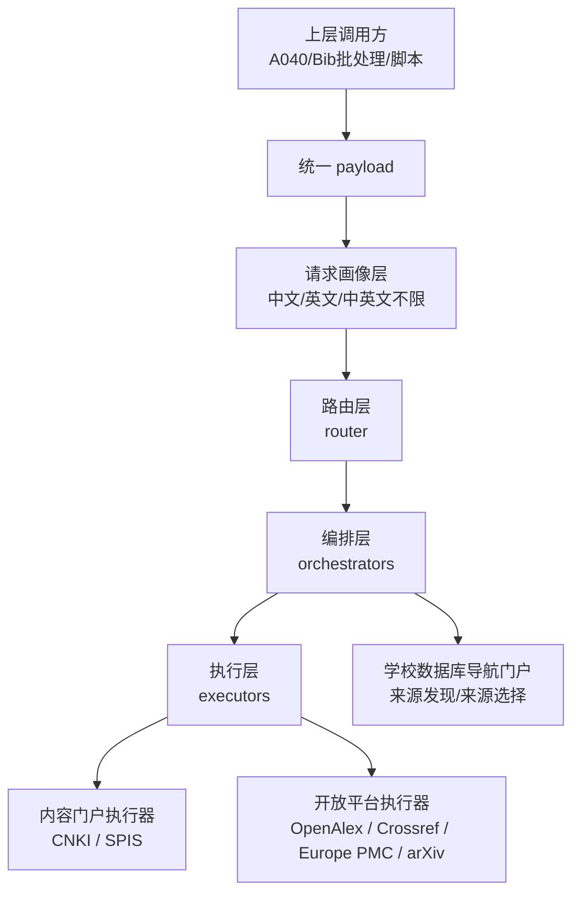
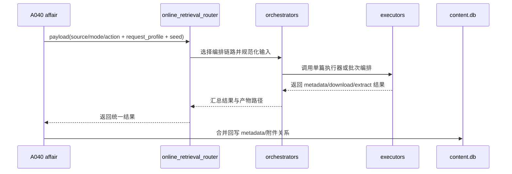

# 在线检索文献模块专题

## 1. 模块目标与边界

在线检索文献模块统一位于 `autodokit/tools/online_retrieval_literatures/`。

本模块的新目标不是继续扩展“中文链路一套、英文链路一套”的拼接式实现，而是建立一套可稳定扩展的统一结构，用来承接以下几类请求：

1. 中文需求。
2. 英文需求。
3. 中英文不限需求。

并在这些请求之上，统一提供以下动作能力：

1. metadata 检索。
2. 单篇下载。
3. 批量下载。
4. 单篇结构化提取。
5. 批量结构化提取。
6. access probe / source selection。
7. retry。

边界约定如下：

1. 对外统一入口仍为 `autodokit.tools.run_online_retrieval_router(payload)`。
2. 路由层只负责识别请求画像、注入策略、选择编排链路。
3. 编排层负责批量组织、来源发现、来源筛选、失败重试和输入规范化。
4. 执行层负责单篇 metadata、单篇 download、单篇 structured extract 的真实执行。
5. A040、Bib 批处理等上层事务只能通过统一路由入口使用本模块。

## 2. 设计口径

### 2.1 理论结构

本模块的新理论结构为：

1. 请求画像层。
2. 路由层。
3. 编排层。
4. 执行层。

其中，请求画像层是上位输入层，不是实现层。

### 2.2 为什么不再使用“解析层 / 功能层”

旧口径中的“解析层 / 功能层”更像程序实现习惯，不足以表达以下关键区别：

1. 谁是真正的单篇能力真相源。
2. 学校数据库导航页到底是内容来源还是来源选择组件。
3. 批量处理、失败重试和单篇执行为何不应混在同一层。

因此，新口径改为“路由层 / 编排层 / 执行层”。



## 3. 来源分类

### 3.1 内容门户

内容门户是可以直接承载单篇文献动作的来源。

当前应按同类建模：

1. CNKI。
2. SPIS。
3. 后续其他具有相同属性的门户。

这里要特别强调：SPIS 不是特殊层级对象，而是和 CNKI 同类的内容门户。区别只在支持范围、页面结构和访问约束，不在于层级归属。

### 3.2 开放平台

开放平台同样属于可承载单篇动作的来源族，例如：

1. OpenAlex。
2. Crossref。
3. Europe PMC。
4. arXiv。

### 3.3 学校数据库导航门户

学校数据库导航页不应被视为内容真相源。

它的职责是：

1. 目录抓取。
2. 来源发现。
3. 来源筛选。
4. access probe。
5. retry 辅助。

因此它属于编排层组件，而不是执行层内容执行器。

## 4. 请求画像层

本模块必须显式支持以下请求画像：

1. 中文需求。
2. 英文需求。
3. 中英文不限需求。

请求画像层的作用是：

1. 影响来源优先级。
2. 影响路由层如何选择编排链路。
3. 影响编排层是否优先使用 CNKI、SPIS、开放平台或学校导航门户辅助来源选择。

### 4.1 为什么“中文 / 英文 / 不限”不进入动作维度

因为这三者表达的是用户约束，不是系统动作。

动作维度回答“系统做什么”，例如：

1. metadata search
2. download
3. structured extract

请求画像回答“系统优先朝哪个来源族组织能力”。

把两者混在一起，会把 routing constraint 和 capability 变成同一个维度，后续会越来越难维护。

## 5. 三层职责

### 5.1 路由层

路由层负责：

1. 接收统一 payload。
2. 识别请求画像。
3. 注入 `retrieval_rules` 和其他配置。
4. 将动作请求映射到合适的编排器。

当前公开入口仍由 `online_retrieval_router.py` 承担。

### 5.2 编排层

编排层负责：

1. 规范化 `entries/records/seed_items/cite_keys/pdf_paths`。
2. 组织批量处理。
3. 做来源发现与来源筛选。
4. 调用学校数据库导航门户。
5. 组织 retry。
6. 做结果汇总与断点续跑。

旧的 `online_retrieval_resolver.py` 中与输入整理、seed 补齐相关的逻辑，应逐步沉淀为编排层的一部分。

### 5.3 执行层

执行层负责真实单篇动作。

正式动作应收口为：

1. single metadata
2. single download
3. single structured extract

任何 batch 逻辑都不应复制执行层核心实现。

## 6. 能力矩阵

能力矩阵建议使用“来源族 × 动作能力”，并为每个格子补充属性。

### 6.1 来源族

1. 内容门户。
2. 开放平台。
3. 学校数据库导航门户。

### 6.2 动作能力

1. metadata search
2. single download
3. batch download
4. single structured extract
5. batch structured extract
6. access probe / source selection
7. retry

### 6.3 单元格属性

每个单元格应记录：

1. 是否实现。
2. 所属层级。
3. 是否稳定。
4. 是否需要人工介入。
5. 支持哪些请求画像。

### 6.4 推荐矩阵理解方式

1. 内容门户负责执行层主能力。
2. 开放平台负责另一类执行层主能力。
3. 学校数据库导航门户主要承担编排层的 access probe / source selection 和 retry 辅助。

## 7. 现有文件与新职责映射

| 文件 | 当前定位 | 新职责建议 |
| --- | --- | --- |
| `online_retrieval_router.py` | 路由入口 | 继续作为唯一公开入口 |
| `online_retrieval_resolver.py` | 输入解析 | 逐步并入编排层输入规范化组件 |
| `online_retrieval_service.py` | 路由矩阵分发 | 逐步拆成多个编排器和调度壳 |
| `retrieval_policy.py` | 规则过滤 | 作为路由层和编排层共享策略组件 |
| `school_foreign_database_portal.py` | 学校门户目录抓取 | 归入编排层来源选择组件 |
| `en_chaoxing_portal_retry.py` | 门户重试 | 归入编排层 retry 组件 |
| `zh_cnki_*` | 中文执行器 | 归入内容门户执行层 |
| `en_open_access_*` | 英文开放源执行器 | 归入开放平台执行层 |

## 8. 对 SPIS 的正式要求

重构后的框架中，SPIS 应作为内容门户正式纳入，而不是停留在附加备注层。

至少应支持以下目标能力：

1. 中文请求画像下的 metadata / download / structured extract。
2. 英文请求画像下的 metadata / download / structured extract。
3. 中英文不限请求下，作为可参与路由竞争的内容门户。

这意味着：

1. SPIS 要进入来源注册表。
2. SPIS 要拥有执行层位置。
3. SPIS 的支持边界要写进能力矩阵，而不是只写在说明文字里。

## 9. 用户使用方式

### 9.1 推荐入口（Python）

```python
from autodokit.tools import run_online_retrieval_router

result = run_online_retrieval_router(
    {
        "source": "en_open_access",
        "mode": "batch",
        "action": "download",
        "records": [
            {"title": "Dilemma not Trilemma", "doi": "10.3386/w21162"}
        ],
        "request_profile": "en",
        "output_dir": "workspace/tasks/demo/en_download",
    }
)
print(result.get("status"))
```

### 9.2 学校数据库导航门户抓取

```python
from autodokit.tools import run_online_retrieval_router

result = run_online_retrieval_router(
    {
        "source": "school_foreign_database_portal",
        "mode": "catalog",
        "action": "fetch",
        "request_profile": "en",
        "library_nav_url": "https://wisdom.chaoxing.com/newwisdom/doordatabase/database.html?choren=1&scope=1&wfwfid=125449&pageId=949810&websiteId=29436&mhType=1&publicId=a80ff01e89fce111ee1b37f761ec0cc0e034&mhEnc=a379e36017c3335b344303f5f4f8af64",
        "subject_categories": ["经济学", "管理学", "综合"],
        "output_dir": "workspace/tasks/demo/school_catalog",
    }
)
```

### 9.3 英文失败项通过学校门户重试

```python
from autodokit.tools import run_online_retrieval_router

result = run_online_retrieval_router(
    {
        "source": "en_open_access",
        "mode": "retry",
        "action": "chaoxing_portal",
        "request_profile": "en",
        "failed_records": [
            {"title": "Some paper", "doi": "10.xxxx/xxxx", "landing_url": "https://..."}
        ],
        "library_nav_url": "https://wisdom.chaoxing.com/newwisdom/doordatabase/database.html?...",
        "output_dir": "workspace/tasks/demo/en_retry",
    }
)
```

## 10. 参数说明

### 10.1 通用路由参数

| 参数 | 候选值/类型 | 默认值 | 说明 |
| --- | --- | --- | --- |
| `source` | 见来源注册表 | 无 | 来源或来源族 |
| `mode` | `search` / `single` / `batch` / `catalog` / `retry` / `debug` | 无 | 运行模式 |
| `action` | `metadata` / `download` / `html_extract` / `fetch` / `chaoxing_portal` / `pipeline` | 无 | 动作 |
| `request_profile` | `zh` / `en` / `mixed` | 推导或空 | 请求画像 |
| `retrieval_rules` | dict | 由 `config.json` 注入 | 过滤规则 |
| `online_retrieval_config_path` | path | `online_retrieval_literatures/config.json` | 配置文件 |
| `output_dir` | path | 各执行器内置默认 | 输出目录 |
| `content_db/content_db_path` | path | 空 | 用于 seed 补齐 |
| `workspace_root` | path | 空 | 用于推导 content_db |
| `seed_items` | list[dict] | [] | 统一 seed 输入 |
| `cite_keys` | list[str] | [] | 统一 seed 输入 |
| `pdf_paths` | list[str] | [] | 统一 seed 输入 |

### 10.2 中文内容门户参数

| 参数 | 候选值/类型 | 默认值 |
| --- | --- | --- |
| `zh_query` | str | 空 |
| `max_pages` | int >= 1 | 1 |
| `zh_output_dir` | path | `sandbox/online_retrieval_debug/outputs/zh_cnki` |
| `keep_browser_open` | bool | true |
| `allow_manual_intervention` | bool | true |
| `cnki_cdp_port` | int | 9222 |
| `cnki_cdp_url` | str | `http://127.0.0.1:{port}` |
| `cnki_entry_url` | str | `https://kns.cnki.net/kns8s/search` |
| `cnki_skip_launch` | bool | false |
| `cnki_browser_config.timeout_ms` | int | 15000 |
| `result_index` | int | 0 |
| `prefer_database_tokens` | str | `学术期刊,中国学术期刊,学位论文` |

### 10.3 英文开放平台参数

| 参数 | 候选值/类型 | 默认值 |
| --- | --- | --- |
| `query` | str | 空 |
| `max_pages` | int >= 1 | 1 |
| `per_page` | int >= 1 | 20 |
| `sources` | list[str] | `openalex,crossref,europe_pmc,arxiv` |
| `max_downloads` | int | 0 |
| `download_request_timeout` | int | 12 |
| `per_record_max_attempts` | int | 6 |
| `enable_barrier_analysis` | bool | false |
| `min_request_delay_seconds` | float | 0.35 |
| `max_request_delay_seconds` | float | 1.6 |
| `min_inter_record_delay_seconds` | float | 2.8 |
| `max_inter_record_delay_seconds` | float | 7.4 |
| `pause_every_records` | int | 7 |
| `min_pause_delay_seconds` | float | 11.0 |
| `max_pause_delay_seconds` | float | 23.0 |
| `html_request_timeout` | int | 20 |
| `bailian_api_key_file` | path | 空 |

### 10.4 学校数据库导航门户参数

| 参数 | 候选值/类型 | 默认值 |
| --- | --- | --- |
| `library_nav_url` | str(url) | 空或默认门户 |
| `portal_url` | str(url) | 兼容参数 |
| `catalog_language` / `language` | `中文` / `英文` | `英文` |
| `subject_categories` / `subject_category` | list[str] 或字符串 | `[经济学, 管理学, 综合]` |
| `require_search_capable` | bool | true |
| `max_databases` | int | 0 |
| `timeout` | int | 30 |
| `min_catalog_delay_seconds` | float | 0.4 |
| `max_catalog_delay_seconds` | float | 1.3 |
| `choren` | int | 按语言推导 |

### 10.5 门户重试参数

| 参数 | 候选值/类型 | 默认值 |
| --- | --- | --- |
| `failed_records` | list[dict] | 空 |
| `failed_summary_path` | path | 空 |
| `selected_databases` | list[dict] | 空 |
| `selected_databases_path` | path | 空 |
| `max_databases_per_record` | int >= 1 | 2 |
| `min_portal_retry_delay_seconds` | float | 2.2 |
| `max_portal_retry_delay_seconds` | float | 6.8 |
| `min_inter_record_delay_seconds` | float | 2.7 |
| `max_inter_record_delay_seconds` | float | 7.9 |

## 11. 产物与审计

典型产物包括：

1. `*_summary.json`
2. `*_activity.jsonl`
3. metadata json/jsonl
4. single 或 batch 下载结果 JSON
5. structured extract 结果
6. 学校目录导出：`school_database_catalog.json`、`school_database_selected.json`、`school_database_catalog.jsonl`、`database_entry_list.md`

审计建议如下：

1. 先看状态摘要，例如 `PASS`、`BLOCKED`、`NO_OPEN_PDF`、`MANUAL_REQUIRED`。
2. 再看 activity 日志定位失败位置。
3. 区分“数据库可访问”和“目标文献可自动拿到 PDF”。
4. 对失败项可以进入 retry 或人工接管链路。

## 12. 与 A040 的关系

A040 通过统一路由入口调用本模块。

当前关系应理解为：

1. A040 是上层事务编排方。
2. 在线检索文献模块是来源能力编排与执行方。
3. A040 不应自己复制在线来源能力。

当前实现中：

1. 中文 metadata / download / html_extract 已接入。
2. 英文 metadata / download / html_extract 已接入。
3. 英文下载失败项可以接入学校门户 retry 后备链。
4. 但学校门户“能访问数据库”仍不等于“每篇文献都能自动获得 PDF 直链”。



## 13. 当前专题结论

当前应统一采用以下判断：

1. 模块结构应按“请求画像层 + 路由层 + 编排层 + 执行层”理解。
2. CNKI 与 SPIS 都属于内容门户。
3. 学校数据库导航门户属于编排层来源选择组件。
4. 中文、英文、中英文不限需求不应混入动作维度，而应作为请求画像层。
5. 后续重构应优先让单篇执行真相源清晰，而不是继续给旧的“解析层 / 功能层”叠补丁。
